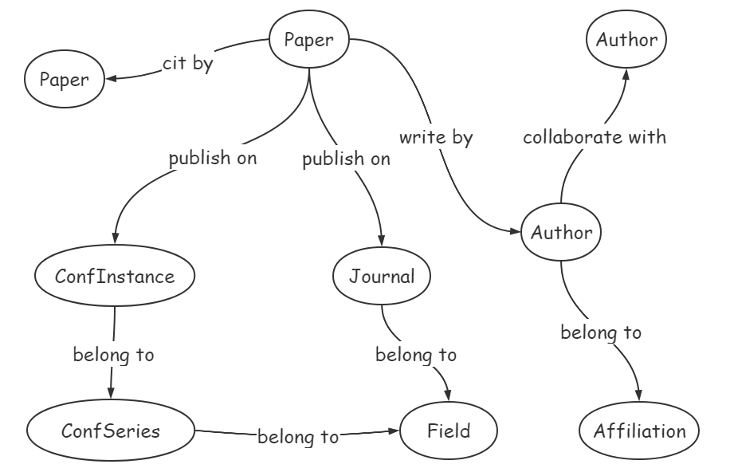

# douCSAce

本科毕业设计

题目：科研快速入门辅助系统

主要任务：为辅助科研人员快速入门，设计一个论文数据系统，能够基于论文不同研究方向呈现学术研究热点趋势以及相关方向的重要论文、学者信息，并能可视化呈现。

特色功能：
- 主要针对计算机领域的学术数据进行可视化分析与展示。
- 结合国内需求，根据《CCF推荐会议和期刊》进行研究方向的划分，可视化显示每个方向的变化趋势和对比。
- 在每个方向中，可视化显示其中每个会议/期刊论文数、被引用数的变化趋势、TOP作者论文信息，以及不同会议/期刊之间的对比。
- 在作者信息中，展示作者的合作关系网。

## 国内外情况

- 传统论文数据系统


- 新型学术图谱系统


## 数据模型设计

系统考虑使用知识图谱技术，知识图谱有三种存储方式：三元组、关系数据库、图数据库。关于数据库选型和 ArangoDB 数据库介绍，请参考我的博客：[ArangoDB入门](https://99mycql.github.io/application/ArangoDB%E5%85%A5%E9%97%A8.html) 。

模型按照 ArangoDB 数据的风格进行设计，分为实体模型和关系模型。

模型关系图如下：



各模型详细设计如下：

- 论文实体模型（Document），表名：`papers`

|Field Name|Field Type|Description|
|---|---|---|
|_key|string|唯一标识，等同于 dblp 中文章的 key ，`_key = dblpKey.replaceAll("/", "-")`，比如：`journals-tocs-BalmauDZGCD20`|
|title|string||
|type|uint|0:Other, 1:Conference, 2:Journal|
|pages|string||
|year|string||
|bookTitle|string|type=1|
|volume|string|type=2|
|number|string|type=2|
|doiUrl|string||
|dblpUrl|string||
|referenceCount|uint64||
|citationCount|uint64||

- 会议实例（哪一年哪一场的会议）实体模型（Document），表名：`confInstances`

|Field Name|Field Type|Description|
|---|---|---|
|_key|string|唯一标识，等同于 dblp 中会议实例的 key ，比如：dblpKey 是 conf/ppopp/2020 ，则 key 为 ppopp-2020|
|title|string||
|publisher|string|出版方|
|bookTitle|string||
|year|string||
|isbn|string|dblp 中会议实例的属性，用处未知，暂且保存下来|
|doiUrl|string||
|dblpUrl|string||
|paperCount|uint64||
|citationCount|uint64||

- 会议实体模型（Document），表名：`confSeries`

|Field Name|Field Type|Description|
|---|---|---|
|_key|string|唯一标识，等同于 dblp 中会议的 key ，`_key = shortName`，比如：`ppopp`|
|shortName|string||
|name|string||
|publisher|string||
|dblpUrl|string||
|paperCount|uint64||
|citationCount|uint64||

- 期刊实体模型（Document），表名：`journals`

|Field Name|Field Type|Description|
|---|---|---|
|_key|string|唯一标识，等同于 dblp 中期刊的 key ，`_key = shortName`，比如：`tocs`|
|shortName|string||
|name|string||
|publisher|string||
|dblpUrl|string||
|paperCount|uint64||
|citationCount|uint64||

- 研究方向实体模型（Document），表名：`fields`

|Field Name|Field Type|Description|
|---|---|---|
|_key|string|唯一标识，`_key = <type>-<name.replaceAll(" ", "_")>`|
|name|string||
|zhName|string||
|type|uint|0:Other, 1:CCF|
|paperCount|uint64||
|citationCount|uint64||

- 作者实体模型（Document），表名：`authors`

|Field Name|Field Type|Description|
|---|---|---|
|_key|string|唯一标识，等同于 dblp 中作者的 pid ，`_key = pid.replaceAll("/", "-")`，比如：`g-RajivGupta`|
|name|string||
|zhName|string||
|urls|string|作者主页，如果有多个则用空格分隔|
|paperCount|uint64||
|citationCount|uint64||

- 机构实体模型（Document），表名：`affiliations`

|Field Name|Field Type|Description|
|---|---|---|
|_key|string|唯一标识，自动生成|
|name|string||
|paperCount|uint64||
|authorCount|uint||
|citationCount|uint64||

- 论文->论文 引用关系模型（Edge），表名：`cit_by`，From 表：`papers`，To 表：`papers`

|Field Name|Field Type|Description|
|---|---|---|
|_key|string|唯一标识，自动生成|
|_from|string| From 表中对应文档的 _id （_id=<表名>/<_key>） |
|_to|string| To 表中对应文档的 _id |

- 论文->会议实例 发表关系模型（Edge），表名：`publish_on_confIns`，From 表：`papers`，To 表：`confInstances`

|Field Name|Field Type|Description|
|---|---|---|
|_key|string|唯一标识，自动生成|
|_from|string| From 表中对应文档的 _id |
|_to|string| To 表中对应文档的 _id |

- 论文->期刊 发表关系模型（Edge），表名：`publish_on_jou`，From 表：`papers`，To 表：`journals`

|Field Name|Field Type|Description|
|---|---|---|
|_key|string|唯一标识，自动生成|
|_from|string| From 表中对应文档的 _id |
|_to|string| To 表中对应文档的 _id |

- 论文->作者 著作关系模型（Edge），表名：`write_by`，From 表：`papers`，To 表：`authors`

|Field Name|Field Type|Description|
|---|---|---|
|_key|string|唯一标识，自动生成|
|_from|string| From 表中对应文档的 _id |
|_to|string| To 表中对应文档的 _id |

- 会议实例->会议 从属关系模型（Edge），表名：`confIns_belong_to_confSer`，From 表：`confInstances`，To 表：`confSeries`

|Field Name|Field Type|Description|
|---|---|---|
|_key|string|唯一标识，自动生成|
|_from|string| From 表中对应文档的 _id |
|_to|string| To 表中对应文档的 _id |

- 会议->研究方向 从属关系模型（Edge），表名：`confSer_belong_to_field`，From 表：`confSeries`，To 表：`fields`

|Field Name|Field Type|Description|
|---|---|---|
|_key|string|唯一标识，自动生成|
|_from|string| From 表中对应文档的 _id |
|_to|string| To 表中对应文档的 _id |
|note|string|备注，若指向的研究方向类型是 CCF ，则备注分类：A、B、C|

- 期刊->研究方向 从属关系模型（Edge），表名：`jou_belong_to_field`，From 表：`journals`，To 表：`fields`

|Field Name|Field Type|Description|
|---|---|---|
|_key|string|唯一标识，自动生成|
|_from|string| From 表中对应文档的 _id |
|_to|string| To 表中对应文档的 _id |
|note|string|备注，若指向的研究方向类型是 CCF ，则备注分类：A 类、B 类、C 类|

- 作者->作者 合作关系模型（Edge），表名：`co_with`，From 表：`authors`，To 表：`authors`

|Field Name|Field Type|Description|
|---|---|---|
|_key|string|唯一标识，自动生成|
|_from|string| From 表中对应文档的 _id |
|_to|string| To 表中对应文档的 _id |

- 作者->机构 从属关系模型（Edge），表名：`author_belong_to_aff`，From 表：`authors`，To 表：`affiliations`

|Field Name|Field Type|Description|
|---|---|---|
|_key|string|唯一标识，自动生成|
|_from|string| From 表中对应文档的 _id |
|_to|string| To 表中对应文档的 _id |
|startYear|string||
|endYear|string||
|note|string|备注|

## 快速开始

### 准备

1. Go 1.14
2. ArangoDB 3.7.6

安装 swag 生成工具：

```
go get -u github.com/swaggo/swag/cmd/swag
```

生成 swagger 文档：

```
swag init
```

在根目录下创建配置文件 `conf.yaml` ，内容如下：

```yaml
```

### 运行

```
go run main.go
```

or 直接生成可执行程序：

```
go build
```
