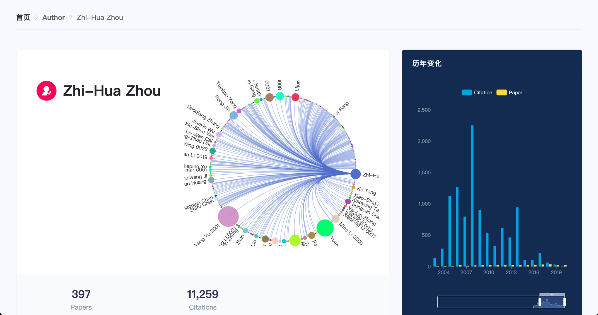

# douCSAce

## 简介

本科毕业设计

题目：科研快速入门辅助系统

主要任务：为辅助科研人员快速入门，设计一个论文数据系统，能够基于论文不同研究方向呈现学术研究热点趋势以及相关方向的重要论文、学者信息，并能可视化呈现。

特色功能：
- 主要针对计算机领域的学术数据进行可视化分析与展示。
- 结合国内需求，根据《CCF推荐会议和期刊》进行研究方向的划分，可视化显示每个方向的变化趋势和对比。
- 在每个方向中，可视化对比不同会议/期刊的论文数、被引用数等，并显示TOP作者、论文信息。
- 在会议/期刊中，可视化展示历年变化趋势，显示TOP作者、论文等信息。
- 在作者信息中，展示作者的合作关系网。

## 展示

### 首页

搜索框可以用于搜索作者、会议和期刊等。支持模糊搜索，输入搜索内容后，会自动弹出匹配结果，各实体结果数量上限为10。点击搜索结果可进入对应页面。


各研究方向的对比分析图，可以对比一至十个不同研究方向，同时可以切换论文数或引用数对比，同时支持缩放拖动对比年份。


研究方向的分类，主要根据CCF分类，分为十大研究方向，展示每个研究方向的论文数和背引用数，点击可以进入对应研究方向页面。


### 研究方向页面

左边展示会议/期刊列表。列表的表头，可以对会议/期刊进行排序，也可以筛选会议或期刊，以及筛选A、B、C分类。列表的每一项，可以点击ShortName部分，将会跳转到对应期刊/会议的页面，同时支持多项选择。列表的右上方，提供三个按钮，分别是清除筛选、取消选择和对比所有项，点击对比所选项，会在右图对比分析所选择的会议/期刊。

右边是会议/期刊对比分析图。同样支持显示隐藏某个会议/期刊，切换论文数和引用数对比，缩放拖动年份等。


研究方向页面的第二部分是Top论文和作者列表。列表根据引用数排序，选择前100项，列表每一页有10项，总共10页，可在列表下方的分页器进行页面跳转。Top作者列表中，还可以点击作者名可以跳转到对应的作者页面。


### 会议/期刊页面

会议/期刊页面第一部分是概览。

左边包含会议/期刊的信息简介：名称、类别、简称、对应DBLP网址等，以及会议/期刊的论文数和引用数。

右边则是会议/期刊历年论文数、引用数的变化分析图。同样，可以点击Citation、Paper图标显示或隐藏引用数、论文数，并可以缩放和拖动年份。


会议/期刊页面第二部分则是会议/期刊中Top作者、论文的列表。同样，列表根据引用数排序，选择前100项，列表每一页有10项，总共10页，可在列表下方的分页器进行页面跳转。Top作者列表中，还可以点击作者名可以跳转到对应的作者页面。


会议/期刊页面第三部分则是会议/期刊中论文的列表。列表左上角显示论文总数，右上角有排序规则选择框，可以选择默认排序、最近排序、最早排序、最多引用排序等。列表的每一项代表一篇论文。

主要信息包含论文名字、年份、发表在的会议或期刊简称。以及论文作者列表，每一个作者都可以点击作者名跳转到作者页面。同时，在论文信息下方显示论文的原文链接、被引用数等。最后，在论文列表的底部，还会显示分页器，用于论文列表页面跳转。


### 作者页面

左边是作者姓名、简介、发表论文数、被引用数等信息，还包含合作者关系图。合作者关系图可以进行缩放、拖动等操作，图中的每一个圆点就代表一个合作者，鼠标移动到圆点上即可显示合作者的名字和合作次数，而只有合作次数超过一定次数（最大合作次数/5）才能在图上直接显示名字。

右边则是作者历年论文数、引用数的变化分析图。




第二部分则是作者的论文列表。


## 快速开始

### 准备

1. [Go](https://golang.org/) 1.14
2. [ArangoDB](https://www.arangodb.com/) 3.7.6

在根目录下创建配置文件 `conf.yaml` ，内容如下：

```yaml
addr: 0.0.0.0:8080
arangoDB:
  url: http://localhost:8529/
  username: dounine
  passwd: 123456
  database: douCSAce
  collections:
    # 各模型对应的集合名（表名）
    paper: papers
    confInstance: confInstances
    confSeries: confSeries
    journal: journals
    field: fields
    author: authors
    affiliation: affiliations
    cit_by: cit_by
    publish_on_confIns: publish_on_confIns
    publish_on_jou: publish_on_jou
    write_by: write_by
    confIns_belong_to_confSer: confIns_belong_to_confSer
    confSer_belong_to_field: confSer_belong_to_field
    jou_belong_to_field: jou_belong_to_field
    co_with: co_with
    author_belong_to_aff: author_belong_to_aff
logPath:
```

安装 swagger 生成工具：

```
go get -u github.com/swaggo/swag/cmd/swag
```

生成 swagger 文档：

```
swag init
```

### 数据爬取

爬取基础数据：

```
go run scripts/dblp_crawler/main.go
```

爬取引用数据：

```
go run scripts/dblp_cit_crawler/main.go
```

也可以参考上述程序代码，自定义爬虫程序爬取数据。

### 运行

```
go run main.go
```

or 直接生成可执行程序：

```
go build
./douCSAce
```

## 国内外情况

- 传统论文数据系统


- 新型学术图谱系统


## 数据模型设计

系统考虑使用知识图谱技术，知识图谱有三种存储方式：三元组、关系数据库、图数据库。关于数据库选型和 ArangoDB 数据库介绍，请参考我的博客：[ArangoDB入门](https://99mycql.github.io/application/ArangoDB%E5%85%A5%E9%97%A8.html) 。

模型按照 ArangoDB 数据的风格进行设计，分为实体模型和关系模型。

模型关系图如下：


各模型详细设计如下：

- 论文实体模型（Document），表名：`papers`

|Field Name|Field Type|Description|
|---|---|---|
|_key|string|唯一标识，等同于 dblp 中文章的 key ，`_key = dblpKey.replaceAll("/", "-")`，比如：`journals-tocs-BalmauDZGCD20`|
|title|string||
|type|uint|0:Other, 1:Conference, 2:Journal|
|pages|string||
|year|string||
|bookTitle|string|type=1|
|volume|string|type=2|
|number|string|type=2|
|doiUrl|string||
|dblpUrl|string||
|referenceCount|uint64||
|citationCount|uint64||

- 会议实例（哪一年哪一场的会议）实体模型（Document），表名：`confInstances`

|Field Name|Field Type|Description|
|---|---|---|
|_key|string|唯一标识，等同于 dblp 中会议实例的 key ，比如：dblpKey 是 conf/ppopp/2020 ，则 key 为 ppopp-2020|
|title|string||
|publisher|string|出版方|
|bookTitle|string||
|year|string||
|isbn|string|dblp 中会议实例的属性，用处未知，暂且保存下来|
|doiUrl|string||
|dblpUrl|string||
|paperCount|uint64||
|citationCount|uint64||

- 会议实体模型（Document），表名：`confSeries`

|Field Name|Field Type|Description|
|---|---|---|
|_key|string|唯一标识，等同于 dblp 中会议的 key ，`_key = shortName`，比如：`ppopp`|
|shortName|string||
|name|string||
|publisher|string||
|dblpUrl|string||
|paperCount|uint64||
|citationCount|uint64||

- 期刊实体模型（Document），表名：`journals`

|Field Name|Field Type|Description|
|---|---|---|
|_key|string|唯一标识，等同于 dblp 中期刊的 key ，`_key = shortName`，比如：`tocs`|
|shortName|string||
|name|string||
|publisher|string||
|dblpUrl|string||
|paperCount|uint64||
|citationCount|uint64||

- 研究方向实体模型（Document），表名：`fields`

|Field Name|Field Type|Description|
|---|---|---|
|_key|string|唯一标识，`_key = <type>-<name.replaceAll(" ", "_")>`|
|name|string||
|zhName|string||
|type|uint|0:Other, 1:CCF|
|paperCount|uint64||
|citationCount|uint64||

- 作者实体模型（Document），表名：`authors`

|Field Name|Field Type|Description|
|---|---|---|
|_key|string|唯一标识，等同于 dblp 中作者的 pid ，`_key = pid.replaceAll("/", "-")`，比如：`g-RajivGupta`|
|name|string||
|zhName|string||
|urls|string|作者主页，如果有多个则用空格分隔|
|paperCount|uint64||
|citationCount|uint64||

- 机构实体模型（Document），表名：`affiliations`

|Field Name|Field Type|Description|
|---|---|---|
|_key|string|唯一标识，自动生成|
|name|string||
|paperCount|uint64||
|authorCount|uint||
|citationCount|uint64||

- 论文->论文 引用关系模型（Edge），表名：`cit_by`，From 表：`papers`，To 表：`papers`

|Field Name|Field Type|Description|
|---|---|---|
|_key|string|唯一标识，自动生成|
|_from|string| From 表中对应文档的 _id （_id=<表名>/<_key>） |
|_to|string| To 表中对应文档的 _id |

- 论文->会议实例 发表关系模型（Edge），表名：`publish_on_confIns`，From 表：`papers`，To 表：`confInstances`

|Field Name|Field Type|Description|
|---|---|---|
|_key|string|唯一标识，自动生成|
|_from|string| From 表中对应文档的 _id |
|_to|string| To 表中对应文档的 _id |

- 论文->期刊 发表关系模型（Edge），表名：`publish_on_jou`，From 表：`papers`，To 表：`journals`

|Field Name|Field Type|Description|
|---|---|---|
|_key|string|唯一标识，自动生成|
|_from|string| From 表中对应文档的 _id |
|_to|string| To 表中对应文档的 _id |

- 论文->作者 著作关系模型（Edge），表名：`write_by`，From 表：`papers`，To 表：`authors`

|Field Name|Field Type|Description|
|---|---|---|
|_key|string|唯一标识，自动生成|
|_from|string| From 表中对应文档的 _id |
|_to|string| To 表中对应文档的 _id |

- 会议实例->会议 从属关系模型（Edge），表名：`confIns_belong_to_confSer`，From 表：`confInstances`，To 表：`confSeries`

|Field Name|Field Type|Description|
|---|---|---|
|_key|string|唯一标识，自动生成|
|_from|string| From 表中对应文档的 _id |
|_to|string| To 表中对应文档的 _id |

- 会议->研究方向 从属关系模型（Edge），表名：`confSer_belong_to_field`，From 表：`confSeries`，To 表：`fields`

|Field Name|Field Type|Description|
|---|---|---|
|_key|string|唯一标识，自动生成|
|_from|string| From 表中对应文档的 _id |
|_to|string| To 表中对应文档的 _id |
|note|string|备注，若指向的研究方向类型是 CCF ，则备注分类：A、B、C|

- 期刊->研究方向 从属关系模型（Edge），表名：`jou_belong_to_field`，From 表：`journals`，To 表：`fields`

|Field Name|Field Type|Description|
|---|---|---|
|_key|string|唯一标识，自动生成|
|_from|string| From 表中对应文档的 _id |
|_to|string| To 表中对应文档的 _id |
|note|string|备注，若指向的研究方向类型是 CCF ，则备注分类：A 类、B 类、C 类|

- 作者->作者 合作关系模型（Edge），表名：`co_with`，From 表：`authors`，To 表：`authors`

|Field Name|Field Type|Description|
|---|---|---|
|_key|string|唯一标识，自动生成|
|_from|string| From 表中对应文档的 _id |
|_to|string| To 表中对应文档的 _id |

- 作者->机构 从属关系模型（Edge），表名：`author_belong_to_aff`，From 表：`authors`，To 表：`affiliations`

|Field Name|Field Type|Description|
|---|---|---|
|_key|string|唯一标识，自动生成|
|_from|string| From 表中对应文档的 _id |
|_to|string| To 表中对应文档的 _id |
|startYear|string||
|endYear|string||
|note|string|备注|
